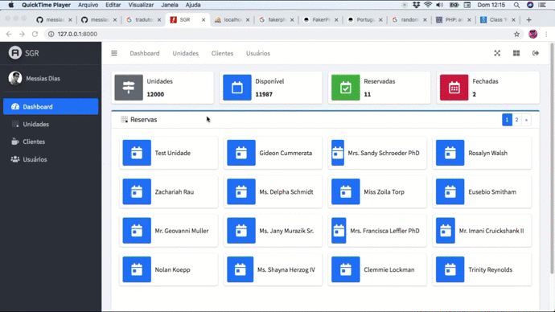
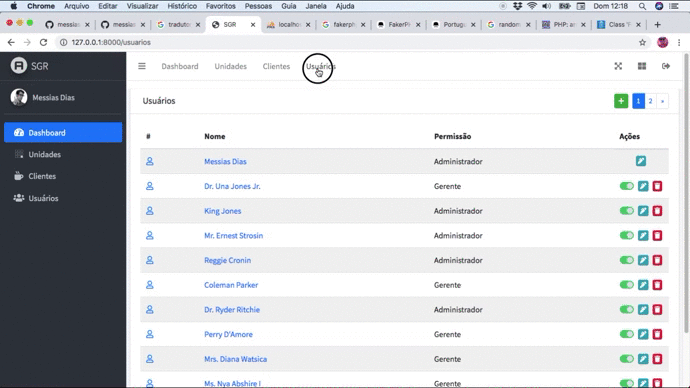
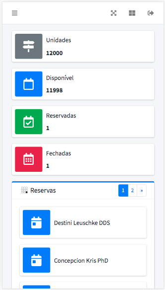

# AlphaViva - Sistema para gerenciamento de reservas 


## Sobre
O software consistem em um gerenciador de reservas para empresas imobiliárias e/ou vendedor independente. Onde o vendedor adiciona seus itens subdividos por `Unidades` (Terreno, Loteamento, Prédio Residencial ou Comercial), estas por sua vez contém `Quadras` (Subidivisão de um Terreno, Bloco de Apartamentos ou Quadras de um Loteamento), estas Quadras também são subdivididas, e estas novas divisões são chamadas de `Lotes` (Literalmente um lote, apartamento ou Sala comercial).


[](https://www.youtube.com/watch?v=RC_OaN8X9Cg)

[](https://www.youtube.com/watch?v=DBhOjUyTrfg)




## Módulos
* Dashboard (Reservas)
* Unidades
* Clientes
* Usuários


## Tecnologias
* Laravel
* Vue.js
* Admin-lte
* Bootstrap


## Instalação
Rode os camandos na Ordem abaixo

```
git clone https://github.com/messiasdias/SGR.git
cd SGR
composer install
cp .env.example .env
php artisan key:generate
php artisan migrate:fresh --seed

npm install
npm run dev
```
## Configuração
Após o processo de instalação dos pacotes php com composer e javascript com npm, preencha o arquivo .env na a raiz de acordo com suas configurações locais. 
Feita a configuração, siga as instruções abaixo para rodar um ambiente de desenvolvimento local.


## Rodando Ambiente de Desenvolvimento
Em terminais separados rode os comandos abaixo para inciar um servidor PHP e Laravel MIX respectivamente, tomando do principio que esteva na raiz do projeto.

> PHP Dev Serve
```
php artisan serve 
```
> Laravel Mix
```
npm run watch
```


## Licença
O SGR é um software de código aberto licenciado sob a [Licença MIT](https://opensource.org/licenses/MIT) desenvolvido e mantido carinhosamente por [Messias Dias](https://github.com/messiasdias).
